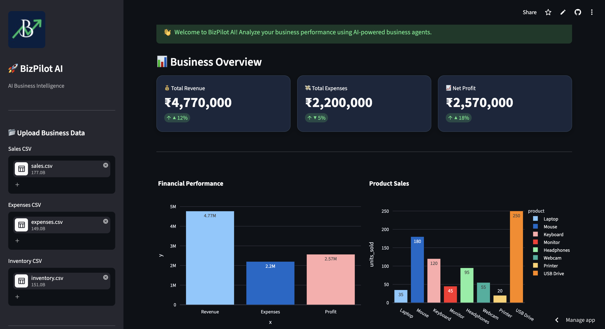
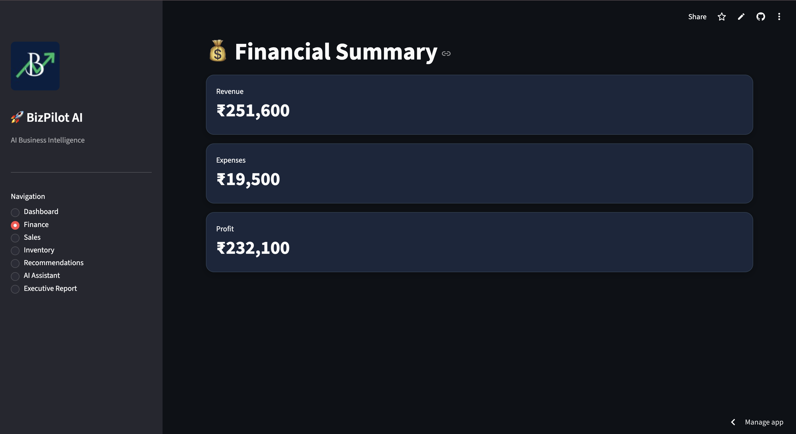
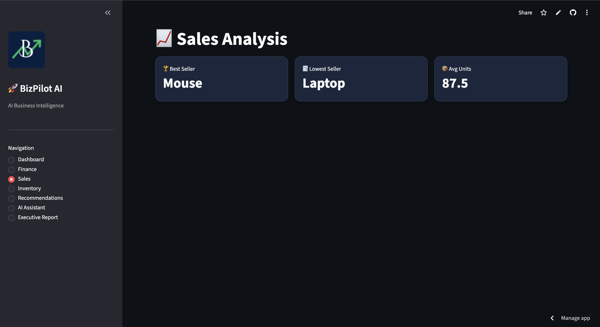
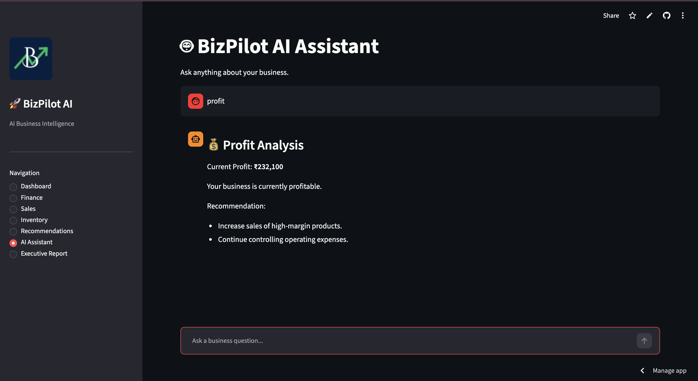
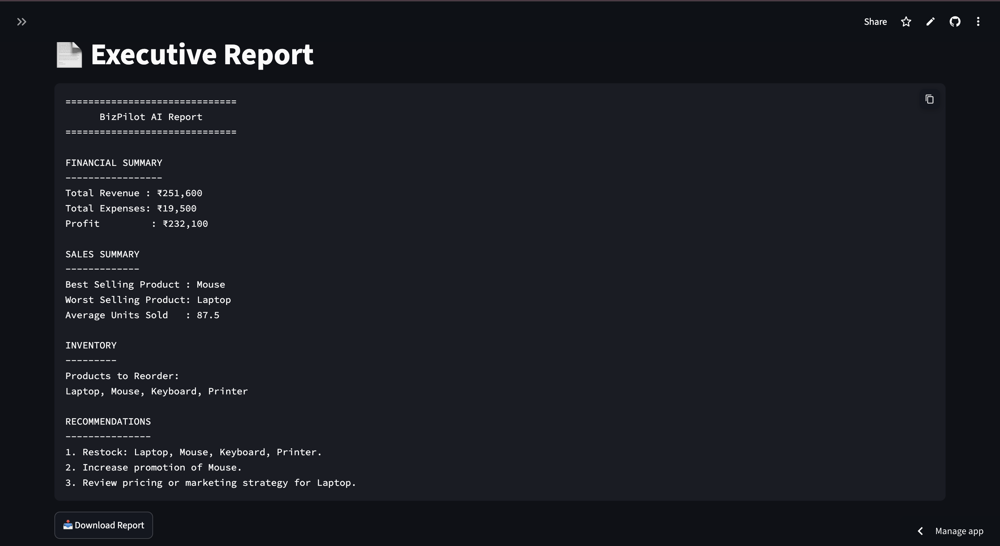

# 🚀 BizPilot AI

> **AI-Powered Multi-Agent Business Intelligence Dashboard**

BizPilot AI is an intelligent business analytics platform that helps businesses analyze their financial performance, sales trends, inventory status, and strategic opportunities using a multi-agent architecture. The application provides interactive dashboards, AI-generated recommendations, and executive reports through a modern Streamlit interface.

## 🌐 Live Demo

https://bizpilot-ai-1.streamlit.app/

---

# 📌 Problem Statement

Small businesses often struggle to analyze large amounts of business data spread across finance, sales, and inventory. Manual analysis is time-consuming and often leads to delayed decision-making.

---

# 💡 Solution

BizPilot AI automates business analysis using specialized AI agents. Each agent focuses on a specific business domain and collaborates to provide actionable insights through an interactive dashboard.

---

# ✨ Features

* 📊 Interactive Business Dashboard
* 💰 Finance Analysis
* 📈 Sales Performance Analysis
* 📦 Inventory Monitoring
* 🧠 AI Business Recommendations
* 🤖 AI Assistant
* 📄 Executive Report Generator
* 📥 Downloadable Business Report
* 📉 Interactive Plotly Visualizations
* 🏢 Multi-Agent Architecture

---

# 🤖 AI Agents

## Finance Agent

* Calculates revenue, expenses, and profit
* Generates financial summaries

## Sales Agent

* Identifies best and worst-selling products
* Calculates average sales performance

## Inventory Agent

* Detects products requiring restocking
* Monitors inventory health

## Strategy Agent

* Generates business recommendations
* Suggests growth opportunities

## Report Agent

* Creates executive-level business reports

---

# 🛠️ Tech Stack

* Python
* Streamlit
* Google ADK
* Google Gemini API
* Plotly
* Pandas
* Git & GitHub

---

# 📂 Project Structure

```text
bizpilot-ai/
│
├── agents/
├── assets/
├── bizpilot/
├── datasets/
├── frontend/
├── tools/
├── tests/
│
├── main.py
├── requirements.txt
├── README.md
└── .gitignore
```

---

# 🚀 Installation

Clone the repository:

```bash
git clone https://github.com/Bhoomika-Babbar/bizpilot-ai.git
```

Navigate to the project folder:

```bash
cd bizpilot-ai
```

Install dependencies:

```bash
pip install -r requirements.txt
```

Create a `.env` file:

```text
GOOGLE_API_KEY=YOUR_API_KEY
```

Run the application:

```bash
streamlit run frontend/app.py
```

---

# 📸 Application Preview

## 📸 Dashboard



## 💰 Finance



## 📈  Sales



## 🤖 AI Assistant



## 📄 Executive Report



---

# 🔮 Future Enhancements

* Real-time database integration
* Predictive sales forecasting
* Customer analytics
* Voice-enabled AI assistant
* Cloud deployment with authentication
* Automated email reports

---

# 👩‍💻 Author

**Bhoomika Babbar**

Built as a hackathon project to demonstrate AI-powered business intelligence using a multi-agent architecture.

---

# 📄 License

This project is developed for educational and hackathon purposes.
